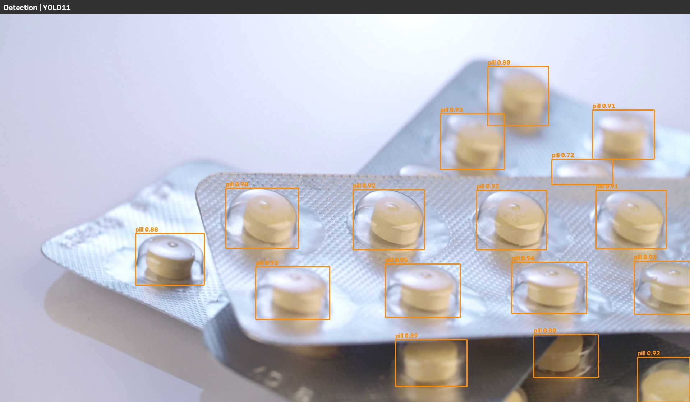
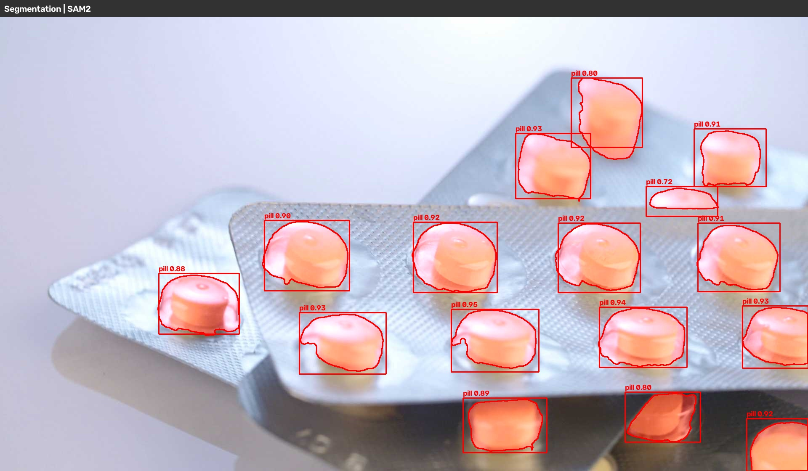

# YOLO11 + SAM2 药丸检测与实例分割

基于 YOLO11 检测 + SAM2 实例分割的药丸检测系统，提供 Flask Web 在线界面。

## 模型特点

| 模型          | 参数    | 作用                     |
| ----------- | ----- | ---------------------- |
| **YOLO11n** | 2.59M | 目标检测，输出药丸的检测框          |
| **SAM2-s**  | 46M   | 实例分割，以检测框为提示，输出像素级精确掩码 |

**工作流程：** 输入图像 → YOLO11 检测药丸位置 → 检测框作为SAM2的框提示 → SAM2 输出每个药丸的精确分割掩码

## 项目结构

```
yolo11_sam2/
├── config.py               # 统一配置
├── train_yolo11.py          # YOLO11 训练脚本
├── inference_pipeline.py    # YOLO11 + SAM2 联合推理
├── visualize.py             # 可视化脚本
├── web.py               # Flask Web 服务
├── templates/index.html     # Web 前端页面
├── utils/xpu_patch.py       # Intel XPU 兼容性补丁
├── medical-pills.yaml       # 数据集配置
├── models/                  # 模型权重
├── datasets/medical-pills/  # 数据集
└── outputs/                 # 推理结果输出
```

## 运行项目

### 1. 数据集

<https://github.com/ultralytics/assets/releases/download/v0.0.0/medical-pills.zip>

### 2. 训练

```bash
python train_yolo11.py
```

### 3. 推理

```bash
# 单张图片
python inference_pipeline.py --image path/to/image.jpg

# 批量推理
python inference_pipeline.py --dir path/to/image_folder/

```

### 4. 可视化

```bash
# 可视化验证集前 N 张图像
python visualize.py --val --num N

# 可视化单张图像
python visualize.py --image path/to/image.jpg

# 可视化整个目录
python visualize.py --dir path/to/images/

```


<br>
图1 yolo 可视化检测框


<br>
图2 sam2 实例分割效果

### 5. Web 界面

```bash
python web.py
# 浏览器打开 对应端口
```

拖拽图片到上传区域，自动推理并显示检测图（YOLO11 检测框）和分割图（SAM2 掩码）。
